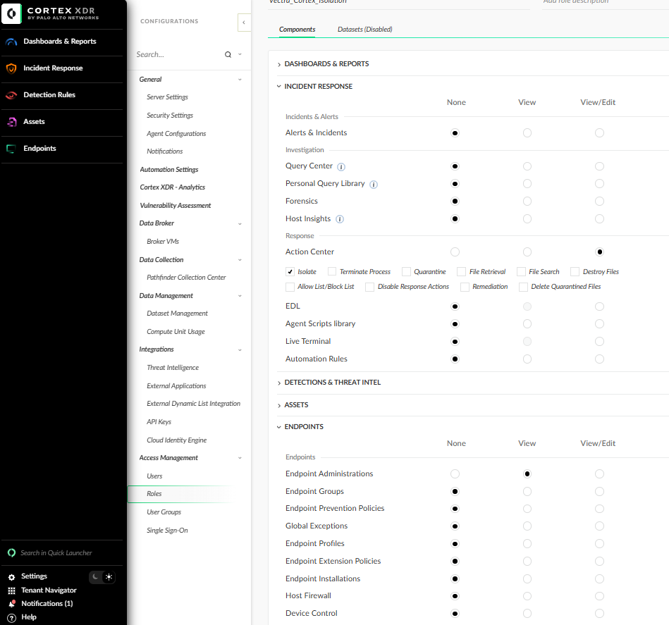

# PAN Cortex Client
# Introduction

This third-party client implements automated blocking by integrating with Cortex EDR. The script utilizes the online API of the Cortex platform.

---

# Getting an API Token

Follow these steps to generate an API token in the Cortex XDR Console:

1. **Log in to the Cortex XDR Console**  
   1. Open the Cortex XDR Console in your browser.  
   2. Log in using an account with administrative privileges.

2. **Navigate to Settings**  
   - Click on the gear icon (**Settings**) in the bottom-left corner.

3. **Create a New Role**  
   - Go to **Access Management > Roles**.  
   - Click **Create New Role**.  
   - Select the following permissions:  
     - **View/Edit** under **Response > Action Center**  
     - **View** under **Endpoints > Endpoints Administration**  
   - Save the new role.  

4. **Create API Keys**  
   - Go to **Integrations > API Keys**.  
   - Click on **New Key** in the top-right corner.  
   - Select **Standard** as the API type and assign the role you created earlier.  
   - Generate the API keys and save them securely, as they cannot be viewed again later.  



---

# About Pending Actions

If a Cortex Agent is offline when an isolate or unisolate action is triggered, it will create a response action with a "PENDING" status. The status of such actions can be retrieved by querying the `/public_api/v1/actions/get_action_status` endpoint. However, the Cortex XDR API does not currently provide an endpoint to delete pending actions.

## Example Scenario

1. An endpoint is prioritized in Vectra and set for blocking.  
2. In the meantime, the Cortex Agent goes offline because the machine is disconnected.  
3. The isolate action in Cortex remains in "PENDING" status, and the endpoint has the following attribute:  
   ```json
   {
     "is_isolated": "AGENT_PENDING_ISOLATION"
   }
   ```
4. The machine or Cortex Agent stays offline.  
5. An analyst determines that the Vectra detections were legitimate and decides to unblock the host.  
6. Vectra attempts to unblock the endpoint by calling `/public_api/v1/endpoints/unisolate`. However, the Cortex API throws an error because it considers the endpoint unisolated due to the pending isolate action.  
7. Vectra will continue trying to unisolate the endpoint on each execution, but the Cortex API will reject the request, as it still sees the endpoint as "unisolated."

---

## Current Limitations and Issues

This issue could be resolved if the Cortex XDR API provided one of the following functionalities:
- An endpoint to delete pending actions.  
- A mechanism where calling `/public_api/v1/endpoints/unisolate` on an endpoint with a pending isolate action cancels the pending isolation action.  

Unfortunately, as of this writing, neither of these options is available. 

---

## Mitigation Strategy

To prevent these issues, the current solution is to only select Vectra entities for isolation in Cortex XDR if the agents are **online** in Cortex XDR.

If the Cortex XDR agent goes offline between the time it is blocked and the time it is selected for unblocking, the following may occur:  
- An "unisolate" pending action will remain in Cortex XDR.  
- If the same host is later selected for blocking again, this will cause conflicts without any straightforward solution.  

---

